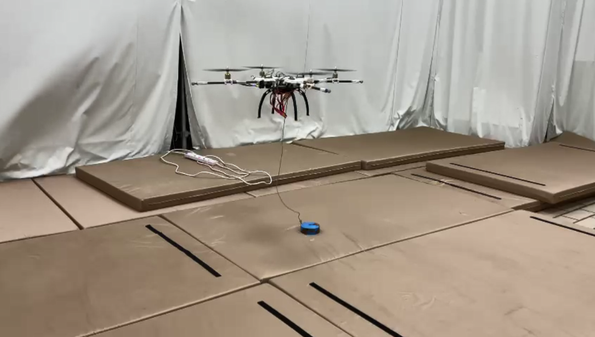

# Unique Flight Controller for a Multirotor

For my Final Year Project (FYP) for my Aerospace Engineering degree with NTU, I designed and built a novel UAV concept for drone based delivery. The prototype I built for the project was able to perform a short hover with attitude control. While I am unable to share the details of the design at the current moment as the research is still ongoing, I shall share the work I did for the project.

To begin with, I created multiple Simulink models with varying levels of complexity to explore how the controller would behave before implementing it. The simulations ranged from a standard model for a quadcopter, followed by a custom model coupled with adjustable parameters and smaller models for testing individual degrees of freedom for the body and their respective controllers. I experimented with theoretical and experimental models for determining the thrust produced at various control outputs. I also tested the model's sensitivity to sensor noise by adjusting how the level of noise introduced in the feedback loop influenced the response of the system. I tested the differences between a continuous model and different sample rates to examine how a discrete controller would perform on the actual hardware which influenced the design of the final controller.

The physical platform for testing was designed in Solidworks combined with downloaded models of typical components like the motor for sizing and designing of fits. The parts were 3D printed, and combined with carbon fibre rods for structure. The microcontroller used was an Arduino Nano BLE Sense 33 because of the in-built IMU and Bluetooth low energy (BLE) chip which could be used for communications.

The actual flight control software was developed from scratch, taking reference to opensource flight controllers like MultiWii and PixHawk4. 

To begin with, I characterised the performance of the BLDC motor and propeller combination used on the drone. This data was used in the simulation, as well as to develop a linearization curve for the ESC control to improve the PID controller performance which are linear controllers.

I used a modified version of the Madgwick filter library for Arduino to account for a variable update rate for the gyroscope, accelerometer and magnetometer sensor fusion to get the estimated attitude of the IMU. On top of that I also implemented coordinate transformations to account for the positioning of the IMU on the body. I implemented an integrator to estimate the velocity and position of the body, but without position updates from GPS or some other sensor, drift rendered the estimates unusable quickly.

The project I worked on relied heavily on the calibration procedures, which not only included basic calibrations for the IMU and magnetometer to remove the bias and hard iron offsets, but also data processing to identify some parameters regarding the positioning of the motors and IMU. In the data processing step I made use of the interquartile range to remove outliers from the average.

I also implemented the remote controller logic and used BLE as the communication protocol. To pair with it, I also developed a companion app using Flutter and Dart. Not only did I get more practice with mobile development, I also learnt more about BLE communication and how to design the characteristics to reduce latency. A picture of the app and how it worked can be seen below.

I translated the controller design originally designed in Simulink into a discrete controller implemented in Arduino. The control architecture for the attitude controller was cascaded, based on the PixHawk4 controller. The mixer was also similarly designed.

Finally I also implemented additional safety features such as a battery monitor to not only determine if the battery was below a critical value, but also to estimate the motor output based on the battery voltage.

I packaged all of this into the main program loop to handle the safety flags and when to run specific coroutines and the like.

The prototype was tested on a 1-DoF and 3-DoF rig to test the controller and tune the gains, before a flight test was performed which confirmed its ability to maintain its attitude in free flight, seen below.

Overall the project allowed me to showcase a number of my skills I picked up from university such as dynamics, control theory and Simulink, CAD and 3D printing, as well as skills I learnt on my own time, such as mobile development and software development in general.