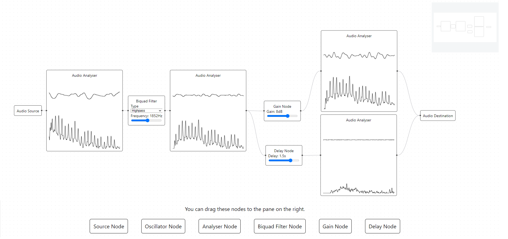

# Sound Site

[Sound Site](https://github.com/Yi-Jiahe/sound-site-react) is a single page React app built with React Flow. React was chosen to give the app interactivity, allowing users to "touch sound", while React Flow was chosen as it was feature rich package, perfect for visualizing and controlling the Audio Graph.

One of the key features of Sound Site is the Analysis node, which allows users to see sound. This feature was built upon from an [earlier attempt](https://github.com/Yi-Jiahe/soundsite) in which I was experimenting with the Web Audio API to see what it could do. I came back to upon discovering React Flow as I felt that I was ready to truly deliver on its promise.