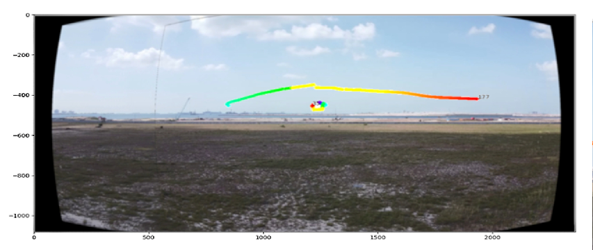
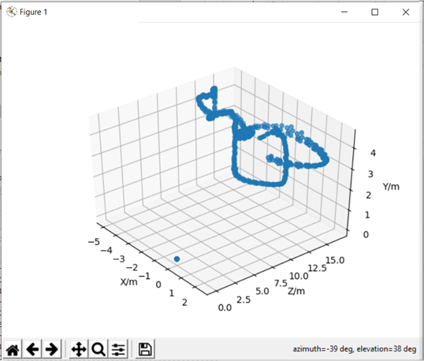

# Motion Based Multiple Object Tracking
During the summer of my 3rd year, I did an internship with Temasek Laboratories at NUS. During my internship, I worked on developing an algorithm to detect and track mulitple moving objects in a scene, and return their 3D positions in real time.

My first task during the internship was to implement an algorithm tested in MATLAB into Python. To do so, I made use of the OpenCV library and got to know the functionality it provided in terms of image and video processing and methods for extracting useful information from images and videos. I also familiarsed myself with data visualization using a combination of OpenCV and the python plotting library matplotlib.

The results of each subsequent filter can be seen below, starting with the background subtraction mask on the bottom left, followed by the dilation operation in the top left, portions of the image to be ignored for processing in the top right and the detected objects in the bottom right. 

The detections were tracked both temporally and spatially, making use of kalman filtering and k-nearest neighbours to ensure that continuous tracking. Optical flow was further used to identify any motions of the camera to distinguish between object and camera movement, allowing for panning motions to be transformed into a panoramic image, keeping the position of the drone fixed in absolute space. The visualized tracks with a panning motion in the video can be seen below, where the transition from green to red shows the time history of the track.

From there, I also studied photogrammetry concepts such as the direct linear transform (DLT), epipolar geometry and triangulation to determine the 3D position of the 2D detections within the images from the cameras. We used a binocular setup to triangulate the 3D position of objects located within the field of view of both cameras. I also made use of the photogrammetry concepts I had learnt to implement an algorithm that would triangulate the position of any object detected by at least two cameras, regardless of their positions or orientations, so long as they were both able to see the object. 

I then worked on implementing the algorithm in real-time, which involved performing the detections on the video stream from multiple cameras, tracking each object, matching their detections from both cameras and performing the triangulation based on the position and pose of each camera containing the detection. The side-by-side tracks of the cameras, as well as the resultant tracks in 3D space can be seen below.

After finishing up the on-site testing, I used the remainder of my time to apply the concepts I had learnt to a simulation to examine if I could apply the same principles to free agents instead of the binocular setup. Both were aware of their position in space and at least one other drone, alongside the camera parameters and detections of both. The simulation can be seen below, which worked rather well.

